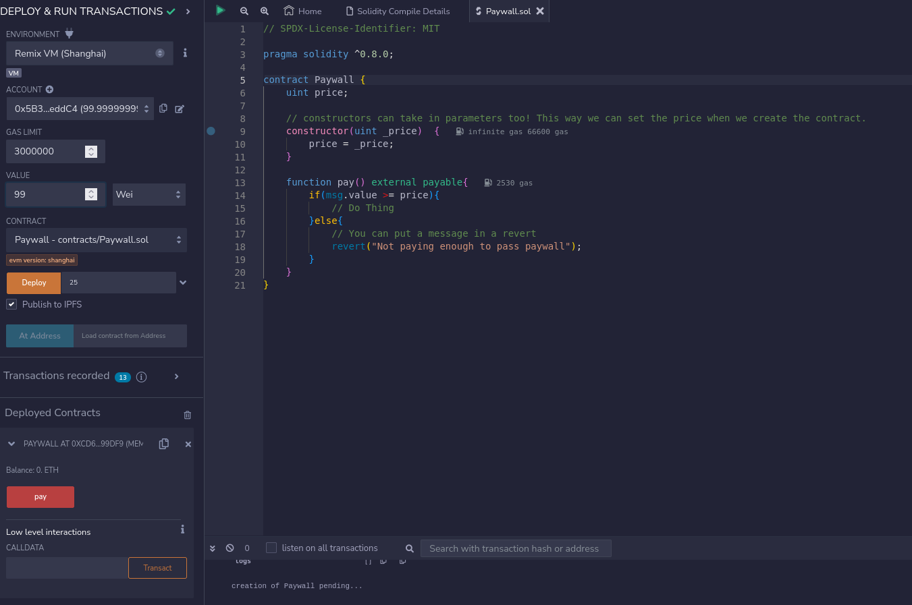

# Day 189 of writing a smart contract a day until ETH hits $10k

**❌🦜 Solidity from the Ground Up:  Ep. 20**

You feel you have a good grasp on functions for now? Don't worry, there's a lot more to talk about and we'll get back to it. But the core concept should be pretty clear by now.
Let's get back to writing some code. And today we're going to learn about sending ETH in Solidity and how to recreate our Paywall code. But in a real smart contract!

## 📚 Since you Didn't do the Homework
Something you would have noticed if you did, is that even if your function does nothing, it preformed a check for value. This is because, by default Solidity functions do not accept ETH. The default compiled code for a function includes some short logic to check if the user sent any ETH, and if they did, revert.  
Today we're going to learn how to accept ETH and work with it.

## 💸 Payable
Remember those function modifiers like "view" or "external" well there's another called "payable" that allows a function to accept ETH.  
Ex. `function myPayableFunction() public payable{MY CODE;}`

And that's it.That's all you need to do. 

And you can get the ETH sent using `msg.value`. Which is a lot like that `msg.sender` we used before. But instead of getting ADDRESS it'll get the CALLVALUE. Or the amount of ETH sent in the transaction

## 💽 Paywall Contract
Let's check out a paywall contract using this!

So here it is. A simple paywall contract! Let's go through it.

1. The constructor accepts a parameter to set "price" as when deployed. In Remix see how you can set that on the left (I entered 25)
2. The pay() function is payable so it can accept ETH
3. We check msg.value to see if it is >= (greater than OR equal to) the price. If so we pretend to do something
4. If not... Then we revert with a custom error.
5. When a function is remix is payable it shows up as red. It's blue if it's view or pure, and orange if normal. If you want to send some ETH with a call to a function in remix you can set the amount on the left where I entered "99"

And that's it! A simple Solidity paywall contract :). Tomorrow we'll take a closer look at those if statements because we never did really go over them.
